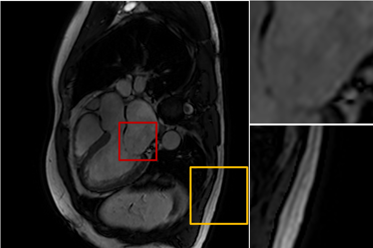
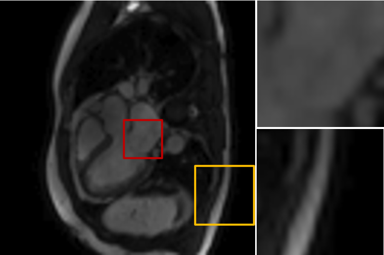
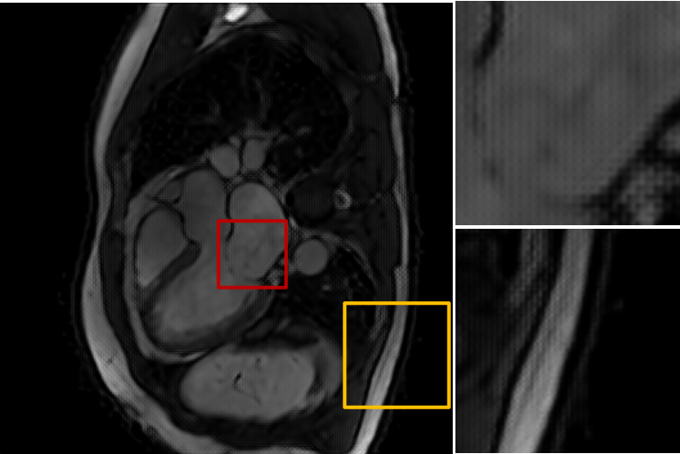
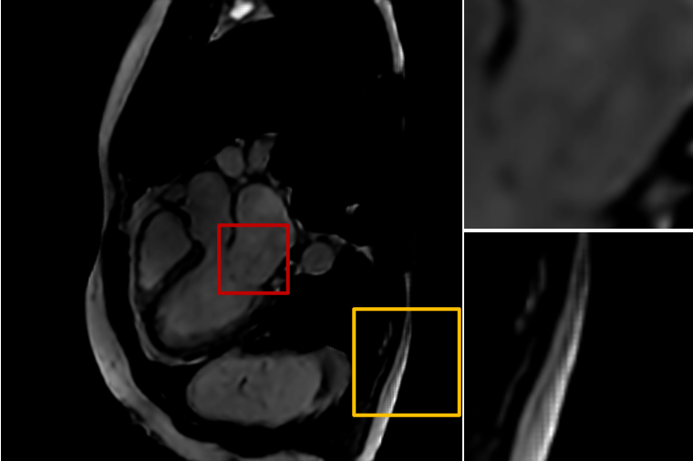
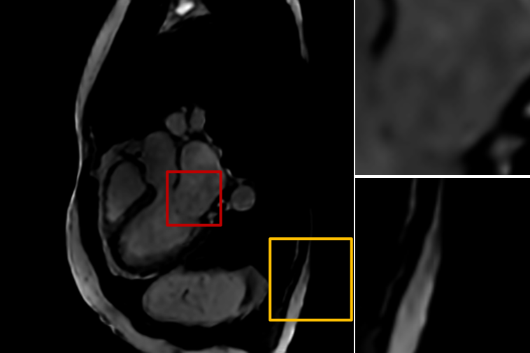

# 2D super-resolution on cardiac MR images

A Keras implementation of super-resolution using perceptual loss from ["Perceptual Losses for Real-Time Style Transfer and Super-Resolution"](https://arxiv.org/abs/1603.08155), as a part of a master thesis project "Super-resolving cardiac MR images using deep learning" at Linköping University.

## Dataset

2D balanced-ssfp slices were used for training/inference. 2D slices were obtained from cine balanced-ssfp volume with spatial resolution of 1 x 1 x 8 mm^3. Obtained 2D slices are used as a hight-resolution target for training the network. Low-resolution input was created by downsampling with bicubic interpolation and adding Gaussian blurring with sigma = 1.0. 

## Network architecture and more

The network consists of 4 residual blocks and 2 upscaling blocks with perceptual loss as a loss function. The network defines perceptual loss by making use of a pretrained VGG16 network. The proposed idea is that the network optimized with perceptual loss conveys better feature representation in terms of perceptual quality, compared to pixel-wise MSE loss. Also, the network utilize transposed convolution as an upscaling method. However transposed convolution often creates unevenly overlapped
pixels (when the kernel size is not divisible by the stride). This behavior ends up adding more of the figurative emphasis in some pixels, which could lead to generating checkerboard artifacts in the super-resolved image. ["Deconvolution and Checkerboard Artifacts"](http://distill.pub/2016/deconv-checkerboard) suggests alternative approach by using, e.g., nearest-neighbor interpolation which does not have overlapping behavior by default.

Hence, in this project following experiments were of interest :  first,  loss function <code> <b>perceptual loss VS MSE loss</b> </code> and second, upscaling method (upscaling factor x4) <code> <b> transposed convolution VS nearest-neighbor interpolation</b> </code>. 

|         |  Loss function  | Upscaling method |
|:-------:|:---------------:|:----------------:|
| Model 1 | Perceptual loss |  Transposed Conv |
| Model 2 | Perceptual loss | NN interpolation |
| Model 3 |     MSE loss    |  Transposed Conv |
| Model 4 |     MSE loss    | NN interpolation |


## Training detail
Training was performed on a workstation with a 3.6GHz, 6-core processor with 64GB RAM, NVIDIA Quadro P6000 GPU.

## Usage
Activate the virtual environment (see requirements.txt) and simply run the code by e.g. <code>python train.py</code>
### Train
```shellscript
usage: train.py [-h] [--init_epoch INIT_EPOCH] [--num_epoch NUM_EPOCH] [--batch_size BATCH_SIZE]
                [--mode MODE] [--loss LOSS] [--upscale_factor UPSCALE_FACTOR] [--LR_input_size LR_INPUT_SIZE]
                [--train_data_dir TRAIN_DATA_DIR] [--val_data_dir VAL_DATA_DIR] [--HR_folder HR_FOLDER] [--LR_folder LR_FOLDER]
                [--load_weight_dir SAVE_WEIGHT_DIR] [--save_weight_dir SAVE_WEIGHT_DIR] [--log_dir LOG_DIR]

optional arguments:
-h, --help                 for more help on parameters 
--init_epoch               initial epoch (default:0), if you want to continue training from previous training, set initial_epoch to begin training with
--num_epoch                number of epochs (default:20)
--batch_size               training batch size (default:48)
--mode                     upscaling method, two options: 'NN' for NN interpolation, 'TS' for transposed convolution
--loss                     loss function, two options: 'perceptual' for perceptual loss, 'mse' for MSE loss
--upscale_factor           upscale factor (default:x4)
--LR_input_size            if the size of the input low-resolution image is 88x88 then type in 88 (default:88)
--train_data_dir           path to training dataset, must contain LR_folder and HR_folder
--val_data_dir             path to the validation dataset, must contain LR_folder and HR_folder
--HR_folder                where low-resolution data are saved, specify the folder name
--LR_folder                where high-resolution data are saved, specify the folder name
--load_weight_dir          path to load saved weight to continue training, otherwise set to None (default:None)
--save_weight_dir          path to save training weights
--log_dir                  log directory for tensorboard
```

### Inference
```shellscript
usage: evaluate.py [-h] [--upscale_factor UPSCALE_FACTOR] [--mode MODE] [--loss LOSS] [--LR_input_size LR_INPUT_SIZE]
                   [--test_data_dir TEST_DATA_DIR] [--HR_folder HR_FOLDER] [--LR_folder LR_FOLDER]
                   [--load_weight_dir SAVE_WEIGHT_DIR] [--save_result_dir SAVE_RESULT_DIR] 
  
optional arguments:
-h, --help                 for more help on parameters 
--upscale_factor           upscale factor (default:x4)
--mode                     upscaling method, two options: 'NN' for NN interpolation, 'TS' for transposed convolution
--loss                     loss function, two options: 'perceptual' for perceptual loss, 'mse' for MSE loss
--LR_input_size            if the size of the input low-resolution image is 88x88 then type in 88 (default:88)
--test_data_dir            path to test dataset, must contain LR_folder and HR_folder
--HR_folder                where low-resolution data are saved, specify the folder name
--LR_folder                where high-resolution data are saved, specify the folder name
--load_weight_dir          path to saved weight/checkpoint
--save_result_dir          where generated SR images will be saved
```


## Results

|         |  Loss |  PSNR |  SSIM  | Training time per epoch |
|:-------:|:-----:|:-----:|:------:|:-----------------------:|
| Model 1 | 43.27 | 1.873 | 0.1076 |          1h 4m          |
| Model 2 | 55.69 | 2.843 | 0.1432 |           59m           |
| Model 3 |  0.33 | 4.924 | 0.2686 |           49m           |
| Model 4 |  0.35 | 4.742 | 0.2627 |           45m           |

- Model 1 (Perceptual loss &  Transposed Conv)
<table>
  <tr>
    <td>ground-truth HR</td>
     <td>bicubic interpolation</td>
     <td>generated SR</td>
  </tr>
  <tr>
    <td valign="top"></td>
    <td valign="top"></td>
    <td valign="top"></td>
  </tr>
 </table>

- Model 2 (Perceptual loss & NN interpolation)
<table>
  <tr>
    <td>ground-truth HR</td>
     <td>bicubic interpolation</td>
     <td>generated SR</td>
  </tr>
  <tr>
    <td valign="top"></td>
    <td valign="top"></td>
    <td valign="top"></td>
  </tr>
 </table>

- Model 3 (MSE loss & Transposed Conv)
<table>
  <tr>
    <td>ground-truth HR</td>
     <td>bicubic interpolation</td>
     <td>generated SR</td>
  </tr>
  <tr>
    <td valign="top"></td>
    <td valign="top"></td>
    <td valign="top"></td>
  </tr>
 </table>

- Model 4 (MSE loss & NN interpolation)
<table>
  <tr>
    <td>ground-truth HR</td>
     <td>bicubic interpolation</td>
     <td>generated SR</td>
  </tr>
  <tr>
    <td valign="top"></td>
    <td valign="top"></td>
    <td valign="top"></td>
  </tr>
 </table>


## Discussion
- A network optimized with perceptual loss acquires better perceptual quality even though it gives lower PSNR and SSIM ratio compared to the network that is optimized using MSE loss. This is in line with <i> " the goal of these experiments is not to achieve state-of-the-art PSNR or SSIM results, but instead to showcase the qualitative difference between models trained with per-pixel and feature reconstruction losses."</i> from the paper.
+ The following equation shows that higher PSNR value can be achieved by lowering the MSE loss:
  So naturally the
network optimized with MSE loss will focus on achieving higher PSNR values. PSNR relies on low-level differences between the pixels and does not necessarily correspond to the perceptual quality of the image.

- Transposed convolution is more likely to generate checkerboard artifacts. Results show that nearest neighbor interpolation can be a solution for the checkerboard artifact problem in this case.

- By utilizing nearest neighbor interpolation as an upscaling method instead of transposed convolution which is proposed by the original paper, it was able to handle the checkerboard artifact problem. 

- Uncertainty estimation for each neural network model can give us further understanding of the model such as the robustness of the model. Generated uncertainty maps and warning maps can be found [here](https://github.com/junnjun/Uncertainty-Estimation-for-Deep-Learning-based-SISR)


